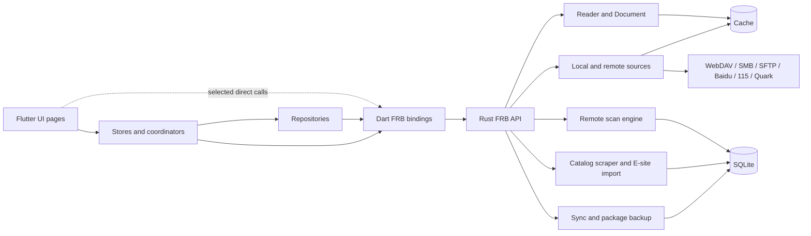

# RCH 架构

> **实现快照：v0.6.2**。依据 2026-10-01 检出的源码整理；本文件记录当前实现和已知边界。
> 产品目标与冻结契约见 [SPEC](project/SPEC.md)，开发历史见 [LOG](project/LOG.md)，后续工作见 [TODO](project/TODO.md)。

## 1. 系统边界

RCH 是 Flutter/Dart 前端与 Rust 核心组成的 Windows、Android 应用。Dart 负责界面和大部分交互状态；Rust 负责漫画容器读取、远程字节读取、扫描、SQLite 持久化、元数据规则、同步与部分图像处理。两侧通过 flutter_rust_bridge（FRB）传递 API、DTO 和字节数据。

Rust 当前是一个 Cargo crate（`app/rust/Cargo.toml`），按领域拆分模块。Dart 有 UI、Store、Coordinator 和少量 Repository；不是所有页面都经过统一的 Repository/use-case 门面。

生成的 Dart 绑定位于 `app/lib/src/rust/`，Rust 绑定位于 `app/rust/src/frb_generated.rs`；不要手工修改生成文件。接口变更按项目 codegen 流程生成。

## 2. Flutter 层

| 目录 | 主要职责 |
|---|---|
| `app/lib/ui/` | 书架、阅读器、来源浏览、详情、设置、同步、更新及刮削界面 |
| `app/lib/store/` | 应用状态、书源会话、同步、远程扫描协调、更新和自动化状态 |
| `app/lib/repository/` | 书籍、标签、阅读记录等部分数据访问封装 |
| `app/lib/src/rust/` | FRB 生成的 Dart API 与 DTO |

较复杂的协调流程集中在 Store/Coordinator。部分 UI（例如同步面板）直接调用生成的 FRB API；新增或修改复杂流程时应评估是否经过手写 Repository/Use-case 边界，避免把业务编排继续放进页面组件。

## 3. Rust 层

入口为 `app/rust/src/lib.rs`，FRB 调用进入 `api/`，再使用领域模块：

| 模块 | 职责 |
|---|---|
| `api/` | Dart 可调用接口，按书籍、书源、同步、扫描、缓存、刮削等领域拆分 |
| `source/` | 本地与云端书源客户端；`ByteSource` 抽象按需读取字节 |
| `document/` | `Document` 抽象与 ZIP/CBZ、EPUB、7Z/CB7、TAR/CBT、PDF、RAR/CBR、MOBI、图片文件夹解析 |
| `reader.rs` | 阅读会话、页面读取和预取调度 |
| `remote_scan/` | Provider adapter、后台扫描引擎、扫描/封面任务状态与持久化 |
| `scraper.rs`, `catalog_context.rs`, `scrape_projection.rs` | 从本地 catalog 上下文生成识别 proposal，并投影至作品元数据/标签 |
| `eh_match.rs`, `eh_import.rs`, `eh_tag_translation.rs`, `eh_subscription.rs` | E 站候选匹配、受控导入计划、标签翻译和独立 EH 订阅流程 |
| `sync/`, `rchpkg/` | 多设备增量同步、冲突合并、同步历史和备份包 |
| `db/`, `cache.rs` | SQLite schema/查询与缓存根、缓存文件管理 |
| `ai/`, `decode.rs`, `perf.rs`, `util.rs` | AI 任务、图片解码、性能计数与通用工具 |

## 4. 关键数据流

### 阅读

1. Flutter 阅读器通过 FRB 请求打开漫画或读取页面。
2. Rust 根据书源选择本地文件或远程 Provider，产生可按需读取的 `ByteSource`。
3. `document/` 将字节源解析为统一的 `Document`，Reader 读取页面并使用缓存/预取。
4. 页面字节返回 Flutter 渲染。容器格式与存储来源因此可以独立扩展。

### 远程索引和封面

Dart 的 `RemoteScanCoordinator` 根据书源会话和目录状态协调任务；Rust 的 `RemoteScanEngine` 通过 `RemoteProviderAdapter` 读取目录、维护扫描状态并持久化。封面任务、扫描状态和逻辑资源清理共用远程扫描的数据模型，但完整 provider 验收仍以对应 Trellis 任务为准。

`source/gate.rs` 为网络请求定义 `Foreground > Prefetch > Cover > Scan` 优先级，并处理排队和 provider 请求节流，使后台扫描与封面任务让出前台阅读请求。

### 元数据识别与 E 站导入

离线智能刮削只读取 SQLite/catalog 中已存在的文件名与目录关系，不因识别而刷新远程目录，也不读取漫画页面。它与 E 站导入是不同流程：E 站流程使用本地 proposal 标题实时搜索候选，再由 `eh_match`/`eh_import` 产出可解释的匹配和导入计划。唯一作品名命中可按发布策略自动导入；歧义或未匹配不产生写入，字段只填空。

EH 订阅则是独立的可选流程，用规则筛选种子文件并保存到用户指定目录，不属于漫画库刮削或阅读链路。

### 同步与备份

Flutter 的 `SyncEngine` 建立 WebDAV 会话后调用 Rust sync API；Rust 负责快照、三方合并、落库和 `sync_history`。同步载荷与 `.rchpkg` 备份共用元数据字段，包括卷 / 话。

已知边界：如果失败发生在 Dart 的 `webdavConnect` 阶段，调用尚未进入 Rust 的同步记录流程；Dart 会更新 `lastError`，但没有对应的 `sync_history` 尝试行。此缺口违反 ADR-027 的“失败也记录”约定，已列入 TODO。

## 5. 持久化与调度

- SQLite 保存书源、作品元数据、标签、索引、同步状态、扫描状态等结构化数据。
- 缓存目录由 Rust `cache::cache_root()` 统一定位；页面、整本原始文件、封面和 AI 结果按用途分开管理。
- 当前数据库入口是进程级 `Mutex<rusqlite::Connection>`。单连接让查询和事务串行；数据库锁内不应执行网络或文件 I/O。是否需要连接池应先以等待时间和并发负载数据为依据。
- 各远程书源保留协议/鉴权专用客户端，并共享阅读优先级门控。当前实现没有一个覆盖所有 Provider 下载的统一 Downloader 调度入口。

## 6. 已知架构债务

1. **边界文件偏大**：`db/mod.rs`、`scraper.rs`、`api/remote_scan.rs`、`home_page.dart`、`source_browser.dart` 和 `library_store.dart` 聚合了多类流程。后续按职责渐进拆分并保持外部契约，不以多 crate 重构作为默认方案。
2. **状态/数据门面不均衡**：Repository 只覆盖部分模型；部分 UI 直接调用 FRB，复杂状态由大型 Store 或页面协调。新增流程优先沉淀到可复用的领域协调器/Repository。
3. **下载器文档与调用不符**：`downloader/mod.rs` 声称所有下载经它处理，但全仓未发现它的外部调用点；Provider 客户端目前自行发请求。需要单独确认模块是遗留代码还是未来入口。
4. **同步连接失败未进入历史**：当前有全局 last error，但每次失败的阶段和时间未写入 `sync_history`。
5. **单连接串行化**：全局 DB mutex 是简单一致的当前实现，也是后台扫描、同步和元数据物化并发增加后的潜在瓶颈；先拆职责、测量，再考虑连接策略。

本文件描述实际实现；若目标方案和当前实现不一致，以 SPEC 中的目标契约为准，并在 TODO/Trellis 中跟踪差距。
